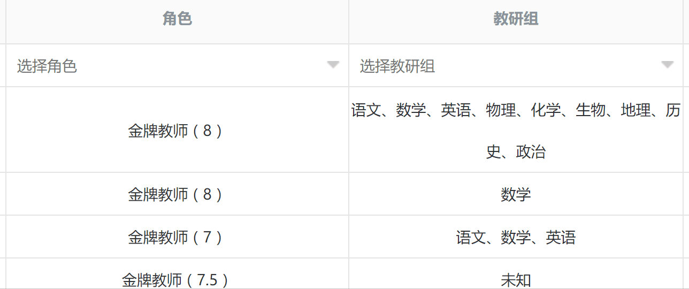

# 记录开发DIY单选多选框背后的逻辑

最近在工程中前端的同事编码时遇到的一些问题“实现的控件样式好看，但是实际体验不好，显示效果常出现意料之外的情况，BUG频出”。这帮助他修bug的同时也促使我最近一直在思考一个问题，作为一个HTML工程师，要实现一些DIY控件，很多时候重心都放在让控件样式优美这类可以直观感受的指标上，隐藏在背后的指标很容易就被忽略——封闭而完备的状态转移逻辑。

BUG频繁出现，最根本的原因就是代码的逻辑并不完备。如何才能如何实现代码才能确保逻辑完备，并没有一套100%通用的方法。因此，打算从这篇笔记开始，记录下问题思考的轨迹，解决问题过程中抽象的模型，状态自动机的转移过程等等，以备将来迭代优化时使用。


## 一、单选框和多选框的异同


### 相同点：
它们都是由一个文本输入框和一个备选词框构成。文本输入框都显示当前已经选择的内容。都可以直接在框中输入文字检索。都可以直接点击选定备选词框中符合要求的候选词。此外，当输入内容和备选内容一致时，都可以自动选定备选内容。非输入状态下，备选词框不可见。


### 不同点：
单选框只能选一个词，多选框可以选多个。

从上面的对比来看，单选框和多选框绝大部分都是相同的，只有可选词数目不同而已。因此，在模型抽象时，可以把两者合二为一，从而简化分析和编码的难度。

## 二、模型
从相同点分析中可以得出，框架模型由一个文本输入框（text）和一个列表（list）备选词框构成，list存在显示和隐藏两种状态（1显示/0隐藏，是否显示list由text是否有是否有焦点决定）。

事件模型（状态转移）包括：1、响应text的input事件（keyup事件在粘贴时失效），触发备选词变更。2、tap和click事件，触发选定和取消候选词。3、text的focus/blur事件，触发备选词的显示/隐藏。

从不同点分析，模型需要一个状态当前在编辑的候选词，由于已经选定和正在编辑的候选词，都在text中显示着，所以可以使用selectionStart获取的光标的位置才计算当前正在编辑的候选词。（对于单选框而言，正在编辑的候选词只能是第一个词。多选框不一样，可以编辑“，”之间的任何一个候选词）。

## 三、状态转移过程

焦点 | 编辑词 | 词数 | 事件（所有输入词语集合I，所有选项集合C，点击词语T） | 转移至 | 焦点 | 编辑词 | 词数 | 说明
--- | ------ | ---- | ----------------------------------------------- | ----- | ---- | ----- | ---- | ---
 0  |  Null  | N    | Text.focus                                      |       | 1    |  Y    | N    | 激活控件进入输入状态，
 1  |  X     | N    | Text.click                                      |       | 1    |  Y    | N    | 更改光标位置，变更编辑词
 1  |  X     | N    | List.click, T ∈ I                              |       |  1   |   Y   | N - 1 | 去掉输入词中包含的T
 1  |  X     | N    | List.click,T∉I,X≠T,X∈C                         |       |  1   |  X    | N+1   | I集合中新增一个词T
 1  |  X     | N    | List.click,T∉I,X≠T,X∉C                          |       | 1    | T     | N     | I集合中将X替换成T
 1  |  X     | N    | Text.Input                                      |       |  1   |  Y     | N     | 词语X变更成新的词语Y
 1  |  X     | N    | Text.input 分隔符（，、）                        |       |  1   |  Y     | N+1   | 输入分隔符，新增加一个词语
 1  |  X     | N    | Text.blur                                       |        | 0    | Null   | M    | 控件失焦，退出输入状态，求I和C的交集，作为最终选词
 


## 四、构造候选词
 
 经过状态转移之后，产生的新集合I，检查C中的每一个词语str，只要集合I中的任何一个元素是str的子串，则str就是可能的候选词。如果str和I中的某一个元素完全一样，那么str就是一个选中的词语。
 
## 五、一些特殊情况的处理

1、为了能实时的获得已选择的词语，每一次选词发生变化都需要即时更新选择的词语并且触发change事件
2、禁用输入（搜索）的情况。当text框被设定为readonly时，也就变成一个最原始的选择框，此时，不论输入内容是什么，都应该显示所有的候选词。
3、当所有输入词语都是选择的词语，那么候选词可以显示直接显示全部内容，方便选择下一个词语。
 
## 六、代码

### 绑定事件
从状态转移分析，需要click事件和focus事件

```javascript
// 事件绑定
$(obj).on('click','.select-icon', function(event){
    clearTimeout(TimeOn);
    tmpInput.focus();
});


$(obj).on('click','.drop-down-li',function(event) { 
    var text = $(this).attr('data-name');             
    var data = tmpInput.val();
    var list = process(data, text, inputOffset);
    renderCandidate(list.candidate);
    renderShow(list.list);
    if (isMulti) {
        clearTimeout(TimeOn);
        tmpInput.trigger('focus');
    }
    event.stopPropagation();
});


$(obj).on('input', 'input', function(){
    inputOffset = this.selectionStart;
    var data = $(this).val();
    var list = process(data, null, inputOffset);
    renderCandidate(list.candidate);
    renderShow(list.list);
});

// 失去焦点
tmpInput.blur(function(){ 
    inputOffset = this.selectionStart;
    TimeOn = setTimeout(function(){realBlur();}, 400);       
});

// 获得焦点
tmpInput.focus(function() {
    // TODO：显示备选框
    var data = $(this).val();
    inputOffset = this.selectionStart;
    var list = process(data, null, inputOffset);

    // TODO: 渲染
    renderConfig();
    renderCandidate(list.candidate);
    renderShow(list.list);

});
```


### 构造输入框和候选框的解

```javascript
function process(originalData, selectedWord, offset) {
    var list = getWordList(originalData, offset);
    list = getWordStatus(list);
    list = removeSelectedWord(list, selectedWord);
    var candidate = getCandidate(list);
    return {list: list, candidate: candidate};
}
```

### 将输入字串构造成输入集合I
单选整个输入内容就是唯一元素
多选则根据分隔符，进行划分
划分后确定当前正在编辑的词X

```javascript
function getWordList(s, offset) {
    var list = [s];
    if (isMulti) {
        list = s.split(/[,，、]/);
    }
    var ret = [];
    var len = 0;
    for (var i in list) {
        var tmp = {};
        tmp.data = list[i];
        tmp.editing = false;
        if (!isMulti || (len <= offset && len + list[i].length >= offset)) {
            tmp.editing = true;
        }
        ret.push(tmp);
        len += list[i].length;
        len++;
    }
    return ret;
}
```

### 填充I中每个元素的属性
1、是否是已经选择的词语
2、有多少候选词包含当前输入词语（如果已经选择，但是候选词不止一个，例如输入AB，候选词AB，ABC都有可能，就要考虑用户可能继续输入C这一情况）

```javascript
function getWordStatus(list) {
    var ret = [];
    for (var i in list) {
        list[i].selected = false;
        list[i].id = -1;
        list[i].cnt = 0;
        for (var j in listSet) {
            var ret = targetCmp(list[i].data, listSet[j].name);
            if (ret == 2) {
                list[i].id = listSet[j].id;
                list[i].selected = true;
            }
            if (ret > 0) list[i].cnt++;
        }
    }
    return list;
}
```

### 去掉输入框中，已选择的词语
当点击候选词的时候，如果本身已经选择过这个词语，就需要去掉当前选择

```javascript
function removeSelectedWord(list, word) {
    if (word == null) return list;
    var ret = [];
    var found = false;
    var target = {};
    target.data = word;
    target.selected = true;
    target.editing = false;
    target.discard = false;
    for(var i in list) {
        list[i].discard = false;
        if (list[i].data == word) {
            found = true;
            list[i].discard = true;
        }
    }
    for(var i in list) {
        if (list[i].discard) continue;
        if (list[i].editing && !found) {
            if (list[i].selected) ret.push(list[i]);
            ret.push(target);
            continue;
        }
        ret.push(list[i]);
    }

    return ret;
}
```

### 寻找候选词
寻找候选词的时候，如果所有输入词语都是已选择的词语，就会显示所有候选词

```javascript
function getCandidate(list) {
    var candidate = [];
    var allSelected = checkAllSelected(list);
    for (var i in listSet) {
        var f = 0;
        for (var j in list) {
            var ret = targetCmp(list[j].data, listSet[i].name);
            if (ret > f) f = ret;
        }
        if (f > 0 || allSelected) {
            candidate.push({id:listSet[i].id, name:listSet[i].name, flag: f});
        }
    }
    return candidate;
}
```


### 部分源码
[JS源码](chosen.js)
